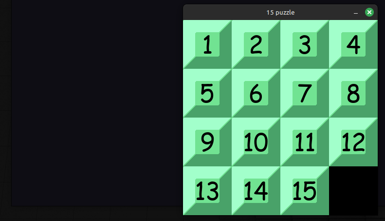

# sliding-puzzle-solver

Data structures and algorithms student project

## Documentation

[User instructions](https://github.com/akskokki/sliding-puzzle-solver/blob/main/docs/instructions.md)

[Project specification](https://github.com/akskokki/sliding-puzzle-solver/blob/main/docs/specification.md)

[Implementation document](https://github.com/akskokki/sliding-puzzle-solver/blob/main/docs/implementation.md)

[Testing document](https://github.com/akskokki/sliding-puzzle-solver/blob/main/docs/testing.md)

#### Weekly progress reports

[Week 1](https://github.com/akskokki/sliding-puzzle-solver/blob/main/docs/week1.md)  
[Week 2](https://github.com/akskokki/sliding-puzzle-solver/blob/main/docs/week2.md)  
[Week 3](https://github.com/akskokki/sliding-puzzle-solver/blob/main/docs/week3.md)  
[Week 4](https://github.com/akskokki/sliding-puzzle-solver/blob/main/docs/week4.md)  
[Week 5](https://github.com/akskokki/sliding-puzzle-solver/blob/main/docs/week5.md)  
[Week 6](https://github.com/akskokki/sliding-puzzle-solver/blob/main/docs/week6.md)
