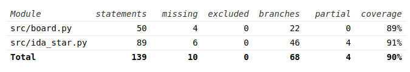
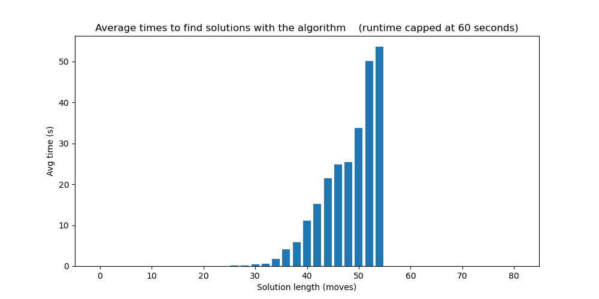

# Testing document

## Unit testing

Testing focus is on the game logic and solving algorithm. The rest of the classes are used to control the UI and console readouts, so they have been left outside of the scope of unit testing.

Performance testing is being worked on, see Week 6 progress report for more information.

## Performance testing

For performance testing, 1130 randomly scrambled solves were attempted and logged, with a runtime limit of 60 seconds for the algorithm. This showed that the algorithm can handle boards up to a complexity of 54 moves with this time limit.

