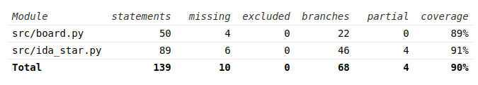

# Testing document

Testing focus is on the game logic and solving algorithm. The rest of the classes are used to control the UI and console readouts, so they have been left outside of the scope of unit testing.

Performance testing is being worked on, see Week 6 progress report for more information.
